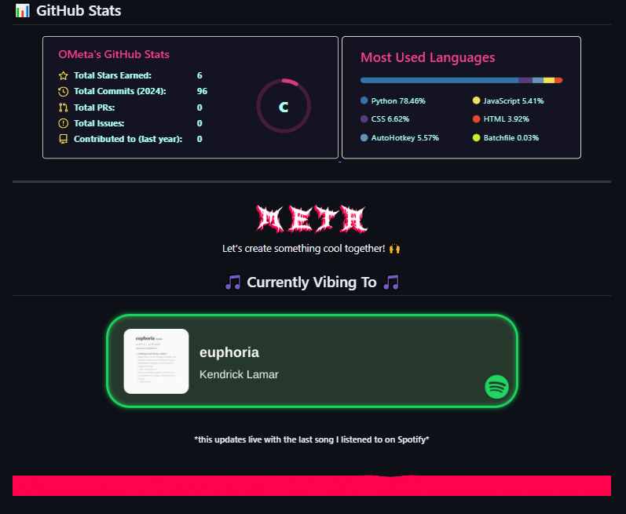

<div align="center">
  

An open-source, cross-platform Spotify Now Playing display<br />
compatible with Windows, macOS, and Linux, utilizing Spotify's API<br />
to show your currently playing track in real-time

<a href="https://github.com/OMetaVR/Spotify-recently-played-readme-status/stargazers"></a>
<a href="https://github.com/OMetaVR/Spotify-recently-played-readme-status/issues"></a>
<a href="https://github.com/OMetaVR/Spotify-recently-played-readme-status/LICENSE"></a>

---



</div>

## 🌟 Features

- 🎵 Real-time display of currently playing Spotify track
- 🖼️ Album artwork display
- 👨‍💻 Cross-platform support (Windows, macOS, Linux)
- 🚀 Lightweight and efficient
- 🔒 Secure authentication with Spotify API
- 🎨 Customizable display options
- 🔄 Automatic updates of track information

## 📥 Installation Guide

### Prerequisites

- Python 3.7 or higher
- pip (Python package installer)
- A Spotify Developer account

### Step 1: Clone the Repository

```bash
git clone https://github.com/OMetaVR/Spotify-recently-played-readme-status.git
cd Spotify-Now-Playing
```

### Step 2: Install Dependencies

```bash
pip install -r requirements.txt
```

### Step 3: Set Up Spotify Developer Application

1. Go to the [Spotify Developer Dashboard](https://developer.spotify.com/dashboard/)
2. Log in with your Spotify account
3. Click "Create an App"
4. Fill in the app name and description
5. Once created, click "Edit Settings"
6. Add `http://localhost:8888/callback` to the Redirect URIs and save

### Step 4: Configure Environment Variables

Create a `.env` file in the root directory of the project and add the following:

```
SPOTIPY_CLIENT_ID=your_client_id
SPOTIPY_CLIENT_SECRET=your_client_secret
SPOTIPY_REDIRECT_URI=http://localhost:8888/callback
```

Replace `your_client_id` and `your_client_secret` with the values from your Spotify Developer Application.

### Step 5: Run the Application

```bash
python main.py
```

The first time you run the application, it will open a web browser for authentication. Log in with your Spotify account and grant the necessary permissions.

### Step 6: Access the Now Playing Display

Once the application is running, you can access your Now Playing display at:

```
http://localhost:10000/now-playing
```

This URL will display an image of your currently playing track, which you can embed in other applications or websites.

### Troubleshooting

If you encounter any issues during installation or setup, please check the following:

- Ensure all environment variables are correctly set in the `.env` file
- Check that your Spotify Developer Application settings are correct
- Make sure you're using a compatible Python version

For more detailed troubleshooting, please refer to the [Issues](https://github.com/OMetaVR/Spotify-recently-played-readme-status/issues) section of the repository.

## 🛠️ Configuration

You can customize the display by right-clicking on the app and selecting "Settings". Options include:

- Display size
- Color scheme
- Information to display (artist, album, track progress, etc.)
- Behavior when no track is playing

## 🤝 Contributing

Contributions are welcome! Please feel free to submit a Pull Request.

1. Fork the repository
2. Create your feature branch (`git checkout -b feature/yourAmazingFeature`)
3. Commit your changes (`git commit -m 'Add some AmazingFeature'`)
4. Push to the branch (`git push origin feature/yourAmazingFeature`)
5. Open a Pull Request

## 📄 License

This project is licensed under the Unlicensed License. See the [LICENSE](LICENSE) file for details.

## 🙏 Acknowledgments

- [Spotify API](https://developer.spotify.com/documentation/web-api)
- [Flutter](https://flutter.dev) for the cross-platform framework
- [spotipy](https://github.com/plamere/spotipy) for Python Spotify API wrapper
